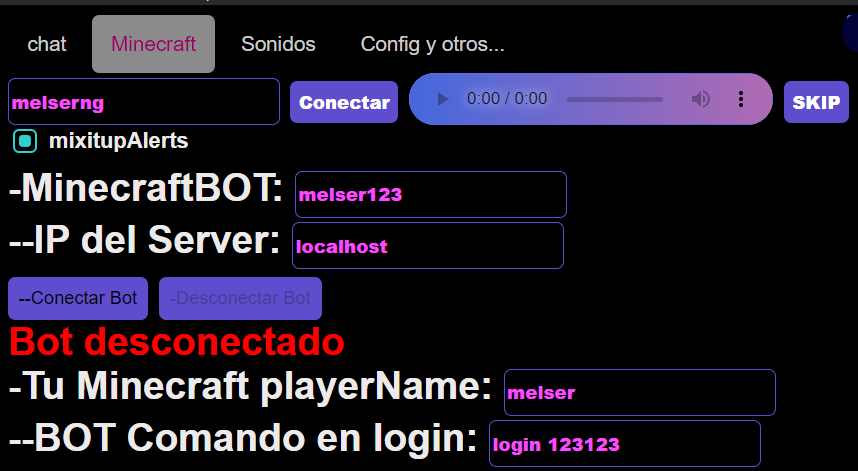

## Instalación y Configuración Inicial
Crea un bot para interactuar en un servidor
## Minecraft interactivo
Puede configurar el bot para definir su:
- nombre del bot
- Ip del server : puerto
- Su nombre del jugador minecraft
- comando inicial



Aqui le muestro la sintaxis de minecraft :
- Eventos como:
1. chat 
2. gift 
3. follow 
4. share
- Para los comando coloque:
ESTE ES UN EJEMPLO PARA Minecraft TNT 

```
chat:
  - "/tellraw @a {\"text\":\"uniqueId : comment \", \"color\":\"green\"}"
  - "/execute at playername run function wasd.tnt:explode/inverted"
likes:
  default:
    - "/title @a title {\"text\":\" 50 likes \"}"
    - "/title @a subtitle {\"text\":\" uniqueId envio {likes} likes \",\"bold\":true,\"color\":\"gold\"}"
    - "/execute at playername run function wasd.tnt:explode/underwater"
gift:
  default:
    - "/tellraw @a {\"text\":\"uniqueId  sent a giftName xrepeatCount \", \"color\":\"gold\"}"
    - "/title @a subtitle {\"text\":\"ENVIO giftName xrepeatCount \",\"bold\":true,\"color\":\"gold\"}"
  Taco :
    - "/execute at playername run fill ~-1 ~ ~-1 ~ ~1 ~ minecraft:tnt hollow"
    - "/execute at playername run give @p diamond_leggings{Enchantments:[{id:\"minecraft:protection\",lvl:10}]} 1"
    - "/execute at playername run summon minecraft:creeper ~ ~ ~ {CustomName:'{\"text\":\"uniqueId \"}', CustomNameVisible:1}"
    - "/execute at playername run playsound minecraft:entity.player.levelup ambient @p"       
  TikTok:
    - "/tellraw @a {\"text\":\"uniqueId  sent a giftName xrepeatCount \", \"color\":\"gold\"}"
    - "/title @a subtitle {\"text\":\"ENVIO giftName xrepeatCount \",\"bold\":true,\"color\":\"gold\"}"
    - "/execute at playername run summon minecraft:skeleton ~ ~ ~ {CustomName:'{\"text\":\"uniqueId \"}', CustomNameVisible:1}"
    - "/title @a title {\"text\":\"uniqueId \"}"
  Rose:
    - "/tellraw @a {\"text\":\"uniqueId  sent a giftName xrepeatCount \", \"color\":\"gold\"}"
    - "/title @a subtitle {\"text\":\"ENVIO giftName xrepeatCount \",\"bold\":true,\"color\":\"gold\"}"
    - "/execute at playername run function wasd.tnt:explode/underwater"
  Finger Heart:
    - "/tellraw @a {\"text\":\"uniqueId  sent a giftName xrepeatCount \", \"color\":\"gold\"}"
    - "/title @a subtitle {\"text\":\"ENVIO giftName xrepeatCount \",\"bold\":true,\"color\":\"gold\"}"
    - "/execute at playername run function wasd.tnt:explode/__generated__/block/349"
  Rosa:
    - "/tellraw @a {\"text\":\"uniqueId  sent a giftName xrepeatCount \", \"color\":\"gold\"}"
    - "/title @a subtitle {\"text\":\"ENVIO giftName xrepeatCount \",\"bold\":true,\"color\":\"gold\"}"
    - "/execute at playername run function wasd.tnt:explode/tntnt"
  Heart Me:
    - "/tellraw @a {\"text\":\"uniqueId  sent a giftName xrepeatCount \", \"color\":\"gold\"}"
    - "/title @a subtitle {\"text\":\"ENVIO giftName xrepeatCount \",\"bold\":true,\"color\":\"gold\"}"
    - "/execute at playername run function wasd.tnt:explode/fire"
  Doughnut:
    - "/tellraw @a {\"text\":\"uniqueId  sent a giftName xrepeatCount \", \"color\":\"gold\"}"
    - "/title @a subtitle {\"text\":\"ENVIO giftName xrepeatCount \",\"bold\":true,\"color\":\"gold\"}"
    - "/execute at playername run function wasd.tnt:explode/tntntnt"
    - "/execute at playername run function wasd.tnt:explode/meteor"
  Hands Heart:
    - "/tellraw @a {\"text\":\"uniqueId  sent a giftName xrepeatCount \", \"color\":\"gold\"}"
    - "/title @a subtitle {\"text\":\"ENVIO giftName xrepeatCount \",\"bold\":true,\"color\":\"gold\"}"
    - "/execute at playername run function wasd.tnt:explode/rocket"
    - "/execute at playername run function wasd.tnt:explode/anvil"
    - "/execute at playername run function wasd.tnt:explode/amethyst"
  Mishka Bear:
    - "/tellraw @a {\"text\":\"uniqueId  sent a giftName xrepeatCount \", \"color\":\"gold\"}"
    - "/title @a subtitle {\"text\":\"ENVIO giftName xrepeatCount \",\"bold\":true,\"color\":\"gold\"}"
    - "/execute at playername run function wasd.tnt:explode/tntntnt"
    - "/execute at playername run function wasd.tnt:explode/tntntnt"
    - "/execute at playername run function wasd.tnt:explode/meteor"
    - "/execute at playername run function wasd.tnt:explode/meteor"
  Swan:
    - "/tellraw @a {\"text\":\"uniqueId  sent a giftName xrepeatCount \", \"color\":\"gold\"}"
    - "/title @a subtitle {\"text\":\"ENVIO giftName xrepeatCount \",\"bold\":true,\"color\":\"gold\"}"
    - "/execute at playername run function wasd.tnt:explode/cow"
    - "/execute at playername run function wasd.tnt:explode/tntntnt"
    - "/execute at playername run function wasd.tnt:explode/meteor"
    - "/execute at playername run function wasd.tnt:explode/meteor"
    - "/execute at playername run function wasd.tnt:explode/tntntnt"
    - "/execute at playername run function wasd.tnt:explode/tntntnt"
    - "/execute at playername run function wasd.tnt:explode/meteor"
    - "/execute at playername run function wasd.tnt:explode/meteor"
  Corgi:
    - "/tellraw @a {\"text\":\"uniqueId  sent a giftName xrepeatCount \", \"color\":\"gold\"}"
    - "/title @a subtitle {\"text\":\"ENVIO giftName xrepeatCount \",\"bold\":true,\"color\":\"gold\"}"
    - "/execute at playername run function wasd.tnt:explode/cow"
    - "/execute at playername run function wasd.tnt:explode/tntntnt"
    - "/execute at playername run function wasd.tnt:explode/meteor"
    - "/execute at playername run function wasd.tnt:explode/meteor"
    - "/execute at playername run function wasd.tnt:explode/tntntnt"
    - "/execute at playername run function wasd.tnt:explode/tntntnt"
    - "/execute at playername run function wasd.tnt:explode/withering"
    - "/execute at playername run function wasd.tnt:explode/meteor"
  Money Gun:
    - "/tellraw @a {\"text\":\"uniqueId  sent a giftName xrepeatCount \", \"color\":\"gold\"}"
    - "/title @a subtitle {\"text\":\"ENVIO giftName xrepeatCount \",\"bold\":true,\"color\":\"gold\"}"
    - "/execute at playername run function wasd.tnt:explode/tntntnt"
    - "/execute at playername run function wasd.tnt:explode/tntntnt"
    - "/execute at playername run function wasd.tnt:explode/meteor"
    - "/execute at playername run function wasd.tnt:explode/meteor"
    - "/execute at playername run function wasd.tnt:explode/tntntnt"
    - "/execute at playername run function wasd.tnt:explode/tntntnt"
    - "/execute at playername run function wasd.tnt:explode/meteor"
    - "/execute at playername run function wasd.tnt:explode/meteor"
    - "/gamemode survival playername"
  Leon the Kitten:
    - "/tellraw @a {\"text\":\"uniqueId  sent a giftName xrepeatCount \", \"color\":\"gold\"}"
    - "/title @a subtitle {\"text\":\"ENVIO giftName xrepeatCount \",\"bold\":true,\"color\":\"gold\"}"
    - "/execute at playername run function wasd.tnt:explode/tntntnt"
    - "/execute at playername run function wasd.tnt:explode/tntntnt"
    - "/execute at playername run function wasd.tnt:explode/meteor"
    - "/execute at playername run function wasd.tnt:explode/meteor"
    - "/execute at playername run function wasd.tnt:explode/tntntnt"
    - "/execute at playername run function wasd.tnt:explode/tntntnt"
    - "/execute at playername run function wasd.tnt:explode/meteor"
    - "/execute at playername run function wasd.tnt:explode/meteor"
    - "/gamemode survival playername"
  Whale diving:
    - "/tellraw @a {\"text\":\"uniqueId  sent a giftName xrepeatCount \", \"color\":\"gold\"}"
    - "/title @a subtitle {\"text\":\"ENVIO giftName xrepeatCount \",\"bold\":true,\"color\":\"gold\"}"
    - "/execute at playername run function wasd.tnt:explode/tntntnt"
    - "/execute at playername run function wasd.tnt:explode/tntntnt"
    - "/execute at playername run function wasd.tnt:explode/meteor"
    - "/execute at playername run function wasd.tnt:explode/meteor"
    - "/execute at playername run function wasd.tnt:explode/tntntnt"
    - "/execute at playername run function wasd.tnt:explode/tntntnt"
    - "/execute at playername run function wasd.tnt:explode/meteor"
    - "/execute at playername run function wasd.tnt:explode/meteor"
    - "/gamemode survival playername"
envelope:
  - "/tellraw @a {\"text\":\"uniqueId  comment cofreeeee \", \"color\":\"gold\"}"
  - "/say uniqueId  comment cofreeeee"
  - "/execute at playername run playsound minecraft:entity.player.levelup ambient @p"
subscribe:
  - "/tellraw @a {\"text\":\"uniqueId  subscribe \", \"color\":\"gold\"}"
  - "/say uniqueId  subscribe subscribe"
  - "/execute at playername run playsound minecraft:entity.player.levelup ambient @p"
follow:
  - "/tellraw @a {\"text\":\"uniqueId  te sige \", \"color\":\"gold\"}"
  - "/execute at playername run summon minecraft:villager ~ ~ ~ {CustomName:'{\"text\":\"uniqueId \"}', CustomNameVisible:1}"
  - "/title @a title {\"text\":\"uniqueId \"}"
  - "/title @a subtitle {\"text\":\"te sige \",\"bold\":true,\"color\":\"gold\"}"
welcome:
  - "/say join uniqueId"
  - "/execute at playername run give @a minecraft:golden_apple 1"
share:
  - "/tellraw @a {\"text\":\"uniqueId  compartio \", \"color\":\"gold\"}"
  - "/title @a title {\"text\":\"uniqueId \"}"
  - "/title @a subtitle {\"text\":\"compartio \",\"bold\":true,\"color\":\"gold\"}"
```
Eventos como chat gift follow share
Tambien en caso de comentarios
```
keywordToGive:
  escudo: "minecraft:shield"
  tnt": "minecraft:tnt 10"
keywordToMob:
  enderman": "minecraft:enderman"
  cerdo": "minecraft:pig"
  oveja": "minecraft:sheep"
  vaca": "minecraft:cow"
```
Es para mobs o items para el chat