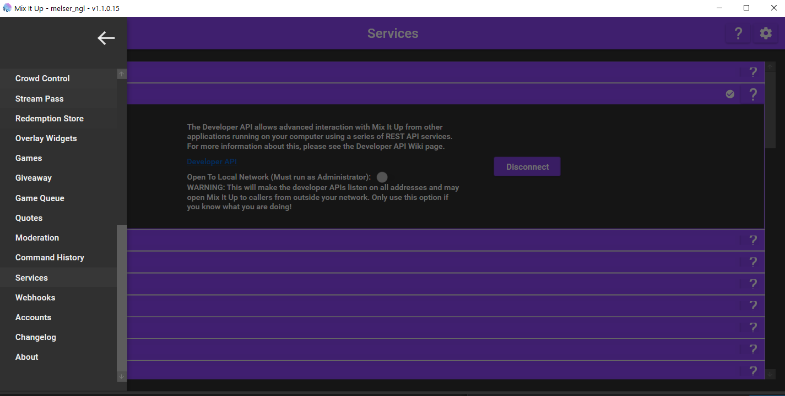
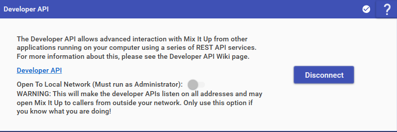

## MixitupApp: 

MixitupApp es un bot de streaming versátil que ofrece funciones para transmisiones en **Twitch**, **YouTube** y **Trovo**. Aquí tienes lo que necesitas saber:

- **Características:**
  Mix It Up es gratuito, de código abierto y está impulsado por la comunidad. Proporciona diversas herramientas para mejorar las transmisiones en vivo.

- **Uso:**
  Los streamers pueden utilizar activamente Mix It Up junto con otros bots, requiriendo al menos 2 horas de contenido en su canal.

- **Soporte de la comunidad:**
  Con más de 2788 descargas, Mix It Up ofrece un comando de interrupción para combatir ataques de odio en Twitch, apoyando a los streamers marginados.

- **Actualizaciones:**
  Las actualizaciones regulares incluyen características como encuestas en Twitch.

- **Participación de la comunidad:**
  Mix It Up tiene una comunidad activa en Reddit con 62 miembros, atendiendo las necesidades de los streamers.

- **Recursos de aprendizaje:**
  Suscribirse a su canal de YouTube proporciona tutoriales y actualizaciones.
### Utilidades de MixitupApp

Esta API envía mensajes de usuarios al chat de Twitch por defecto. Está diseñada para usar:

- Comandos típicos de Twitch, como `!play` o `!sr`.
- Comandos de otras herramientas conectadas a tu canal de Twitch.

MixitupApp ofrece muchas opciones y acciones. Algunos ejemplos:

- **Accion >> Evento**
  !accion evento

- **Gift >> Comando**
  Ejemplo:
  - `Rose` >> `Rose` (comando con este nombre)

#### Requisitos

Puedes crear comandos donde actuarán según el nombre en caso de cada regalo.

1. Activa el soporte de API: **MENU >> SERVICES >> APIDeveloper**
   !Menú de Mixitup

2. Primero, revisa la documentación e información de MixitupApp en YouTube para ver ejemplos.
3. Ingresa con una cuenta de Twitch y configura algunas opciones básicas.
