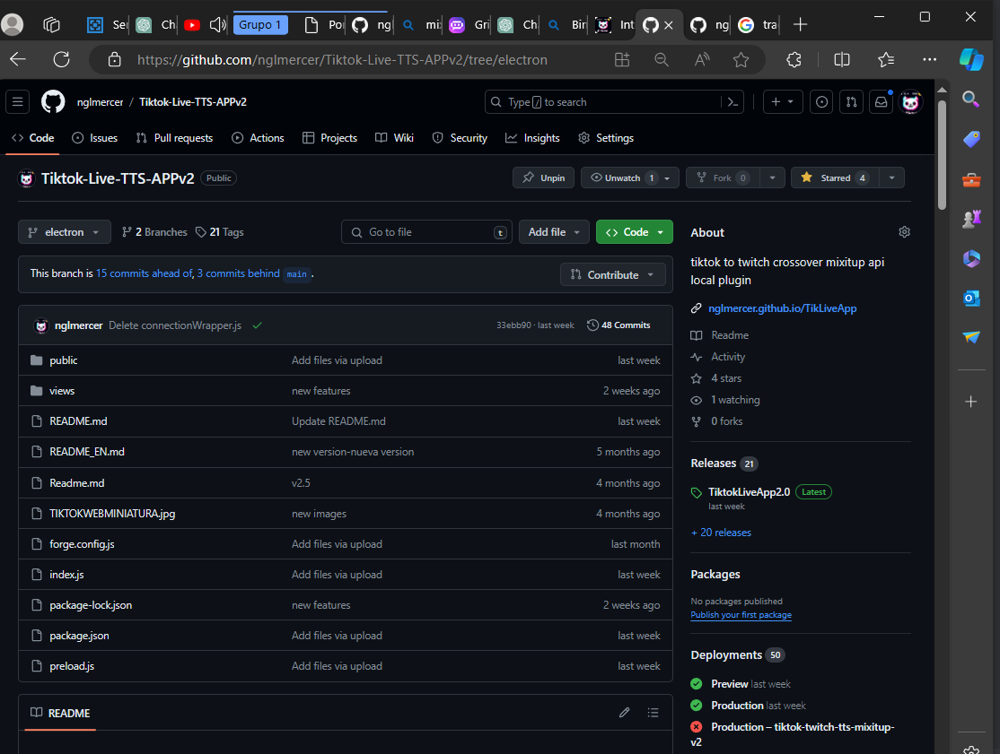
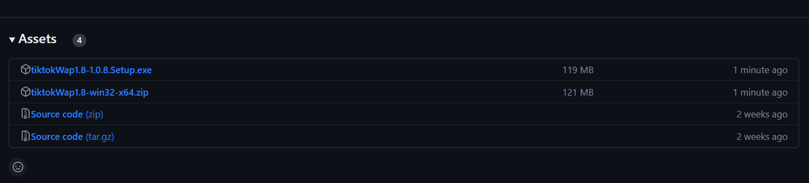
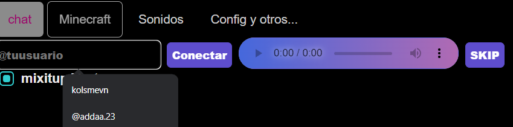

# Introduccion

¡WebApp TiktokLIVE!
herramienta para tiktok live interactivo
## Instalacion
Para instalar la version estable, deber ir y descargar el archivo.zip o el ejecutable del 
### https://github.com/nglmercer/Tiktok-twitch-tts-mixitup-v2
.
### ULTIMOS RELEASES
ejemplo de donde descargar y utilize el zip o exe mas reciente

:::danger[Download exe]
el exe esta en conflicto por que esta en desarrollo recomiendo el zip
:::

:::tip[recomiendo]
Utilze la ultima version o el zip de releases 
:::
## Como conectarse
Coloque su UniqueID para conectarse ejemplo:
- https://www.tiktok.com/@melserng en este caso seria @melserng
y presione conectar y estara conectado.

## Caracteristicas y opciones
Este programa es opensouce revise :
Funcionalidades:
### Speechchat voice chat
(el bot lee tus mensajes) [docs Speechchat](/docs/speechchat). 
- 
### SoundAlerts 
(tiene soporte de alertas de audios y videos) [docs SoundAlerts](/docs/SounAlerts). 
-  
### twitch Crossover 
(puedes conectar tus comandos y el chat de twitch)
-  
### MixitupApp API support 
(conecta mixitupApp para usar todas las herramientas) [docs MixitupApp](/docs/MixitupApp/Introduccion).
-  
### Minecraft interactive Bot 
(crea un bot para que envie los comandos que configures ) [docs MinecraftLive](/docs/MinecraftLive/Minecraft%20Live).
- 
### VRChat chatbox support 
(envia los mensajes al chatbox para leerlo o mostrarlo en el juego)