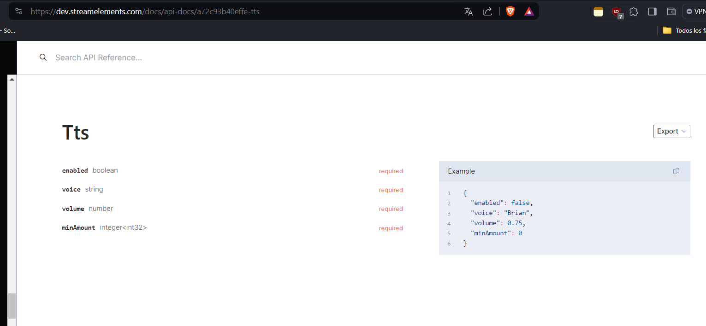

# Speechchat TTS 
### Lee los mensajes que reciben, tiene soporte multidioma.
este bot de voz a sido creado con una api de Steamelements.


## opciones adicionales
Esta diseñado para que tenga controles de audio filtros y una whiteList, usted puede:
- controlar el audio(subir y bajar volumen o mutearlo)

- ... si presiona en mas opciones del reproductor puedes acelerar el audio asi como descargarlo si que esta *disponible*

- añadir filtros: cada palabra que quiera filtrar se separa por cada espacio y si es muy corto y tiene espacio utilize /a a/ en este caso contara como una palabra
- Whitelist cada usuario que si no lee o quieres que lea siempre ---> esto ignora los filtros de spam y demas
:::tip[recomiendo]
si no quiere escuchar escriba en el filtro 
```
a b c d e f g h i j k l m n ñ o p q r s t u v w x y z 
``` 
o simplemente silencie el reproductor.
:::

## *Voces Disponibles:*
```
var VOICE_LIST = {
    "Penélope (Spanish, American)": "Penelope",
    "Miguel (Spanish, American)": "Miguel",
    "Enrique (Spanish, European)": "Enrique",
    "Conchita (Spanish, European)": "Conchita",
    "Mia (Spanish, Mexican)": "Mia",
    "Rosalinda (Spanish, Castilian)": "es-ES-Standard-A",
    "Brian (English, British)": "Brian",
    "Amy (English, British)": "Amy",
    "Emma (English, British)": "Emma",
    "Geraint (English, Welsh)": "Geraint",
    "Russell (English, Australian)": "Russell",
    "Nicole (English, Australian)": "Nicole",
    "Joey (English, American)": "Joey",
    "Justin (English, American)": "Justin",
    "Matthew (English, American)": "Matthew",
    "Ivy (English, American)": "Ivy",
    "Joanna (English, American)": "Joanna",
    "Kendra (English, American)": "Kendra",
    "Kimberly (English, American)": "Kimberly",
    "Salli (English, American)": "Salli",
    "Raveena (English, Indian)": "Raveena",
    "Zhiyu (Chinese, Mandarin)": "Zhiyu",
    "Mads (Danish)": "Mads",
    "Naja (Danish)": "Naja",
    "Ruben (Dutch)": "Ruben",
    "Lotte (Polly) (Dutch)": "Lotte",
    "Mathieu (French)": "Mathieu",
    "Céline (French)": "Celine",
    "Chantal (French, Canadian)": "Chantal",
    "Hans (German)": "Hans",
    "Marlene (German)": "Marlene",
    "Vicki (German)": "Vicki",
    "Aditi (+English) (Hindi)": "Aditi",
    "Karl (Icelandic)": "Karl",
    "Dóra (Icelandic)": "Dora",
    "Carla (Italian)": "Carla",
    "Bianca (Italian)": "Bianca",
    "Giorgio (Italian)": "Giorgio",
    "Takumi (Japanese)": "Takumi",
    "Mizuki (Japanese)": "Mizuki",
    "Seoyeon (Korean)": "Seoyeon",
    "Liv (Norwegian)": "Liv",
    "Ewa (Polish)": "Ewa",
    "Maja (Polish)": "Maja",
    "Jacek (Polish)": "Jacek",
    "Jan (Polish)": "Jan",
    "Ricardo (Portuguese, Brazilian)": "Ricardo",
    "Vitória (Portuguese, Brazilian)": "Vitoria",
    "Cristiano (Portuguese, European)": "Cristiano",
    "Inês (Portuguese, European)": "Ines",
    "Carmen (Romanian)": "Carmen",
    "Maxim (Russian)": "Maxim",
    "Tatyana (Russian)": "Tatyana",
    "Astrid (Swedish)": "Astrid",
    "Filiz (Turkish)": "Filiz",
    "Gwyneth (Welsh)": "Gwyneth",
    "Carter (English, American)": "en-US-Wavenet-A",
    "Paul (English, American)": "en-US-Wavenet-B",
    "Evelyn (English, American)": "en-US-Wavenet-C",
    "Liam (English, American)": "en-US-Wavenet-D",
    "Jasmine (English, American)": "en-US-Wavenet-E",
    "Madison (English, American)": "en-US-Wavenet-F",
    "Mark (English, American)": "en-US-Standard-B",
    "Vanessa (English, American)": "en-US-Standard-C",
    "Zachary (English, American)": "en-US-Standard-D",
    "Audrey (English, American)": "en-US-Standard-E",
    "Layla (English, British)": "en-GB-Standard-A",
    "Ali (English, British)": "en-GB-Standard-B",
    "Scarlett (English, British)": "en-GB-Standard-C",
    "Oliver (English, British)": "en-GB-Standard-D",
    "Bella (English, British)": "en-GB-Wavenet-A",
    "John (English, British)": "en-GB-Wavenet-B",
    "Victoria (English, British)": "en-GB-Wavenet-C",
    "Ron (English, British)": "en-GB-Wavenet-D",
    "Zoe (English, Australian)": "en-AU-Standard-A",
    "Luke (English, Australian)": "en-AU-Standard-B",
    "Samantha (English, Australian)": "en-AU-Wavenet-A",
    "Steve (English, Australian)": "en-AU-Wavenet-B",
    "Courtney (English, Australian)": "en-AU-Wavenet-C",
    "Jayden (English, Australian)": "en-AU-Wavenet-D",
    "Ashleigh (English, Australian)": "en-AU-Standard-C",
    "Daniel (English, Australian)": "en-AU-Standard-D",
    "Anushri (English, Indian)": "en-IN-Wavenet-A",
    "Sundar (English, Indian)": "en-IN-Wavenet-B",
    "Satya (English, Indian)": "en-IN-Wavenet-C",
    "Sonya (Afrikaans)": "af-ZA-Standard-A",
    "Aisha (Arabic)": "ar-XA-Wavenet-A",
    "Ahmad 1 (Arabic)": "ar-XA-Wavenet-B",
    "Ahmad 2 (Arabic)": "ar-XA-Wavenet-C",
    "Nikolina (Bulgarian)": "bg-bg-Standard-A",
    "Li Na (Chinese, Mandarin)": "cmn-CN-Wavenet-A",
    "Wang (Chinese, Mandarin)": "cmn-CN-Wavenet-B",
    "Bai (Chinese, Mandarin)": "cmn-CN-Wavenet-C",
    "Mingli (Chinese, Mandarin)": "cmn-CN-Wavenet-D",
    "Silvia (Czech)": "cs-CZ-Wavenet-A",
    "Marie (Danish)": "da-DK-Wavenet-A",
    "Annemieke (Dutch)": "nl-NL-Standard-A",
    "Eva (Dutch)": "nl-NL-Wavenet-A",
    "Lars (Dutch)": "nl-NL-Wavenet-B",
    "Marc (Dutch)": "nl-NL-Wavenet-C",
    "Verona (Dutch)": "nl-NL-Wavenet-D",
    "Lotte (Wavenet) (Dutch)": "nl-NL-Wavenet-E",
    "Tala (Filipino (Tagalog))": "fil-PH-Wavenet-A",
    "Marianne (Finnish)": "fi-FI-Wavenet-A",
    "Yvonne (French)": "fr-FR-Standard-C",
    "Gaspard (French)": "fr-FR-Standard-D",
    "Emilie (French)": "fr-FR-Wavenet-A",
    "Marcel (French)": "fr-FR-Wavenet-B",
    "Brigitte (French)": "fr-FR-Wavenet-C",
    "Simon (French)": "fr-FR-Wavenet-D",
    "Juliette (French, Canadian)": "fr-CA-Standard-A",
    "Felix (French, Canadian)": "fr-CA-Standard-B",
    "Camille (French, Canadian)": "fr-CA-Standard-C",
    "Jacques (French, Canadian)": "fr-CA-Standard-D",
    "Karolina (German)": "de-DE-Standard-A",
    "Albert (German)": "de-DE-Standard-B",
    "Angelika (German)": "de-DE-Wavenet-A",
    "Oskar (German)": "de-DE-Wavenet-B",
    "Nina (German)": "de-DE-Wavenet-C",
    "Sebastian (German)": "de-DE-Wavenet-D",
    "Thalia (Greek)": "el-GR-Wavenet-A",
    "Sneha (Hindi)": "hi-IN-Wavenet-A",
    "Arnav (Hindi)": "hi-IN-Wavenet-B",
    "Aadhav (Hindi)": "hi-IN-Wavenet-C",
    "Ishtevan (Hungarian)": "hu-HU-Wavenet-A",
    "Helga (Icelandic)": "is-is-Standard-A",
    "Anisa (Indonesian)": "id-ID-Wavenet-A",
    "Budi (Indonesian)": "id-ID-Wavenet-B",
    "Bayu (Indonesian)": "id-ID-Wavenet-C",
    "Gianna (Italian)": "it-IT-Standard-A",
    "Valentina (Italian)": "it-IT-Wavenet-A",
    "Stella (Italian)": "it-IT-Wavenet-B",
    "Alessandro (Italian)": "it-IT-Wavenet-C",
    "Luca (Italian)": "it-IT-Wavenet-D",
    "Koharu (Japanese)": "ja-JP-Standard-A",
    "Miho (Japanese)": "ja-JP-Wavenet-A",
    "Eiko (Japanese)": "ja-JP-Wavenet-B",
    "Haruto (Japanese)": "ja-JP-Wavenet-C",
    "Eichi (Japanese)": "ja-JP-Wavenet-D",
    "Heosu (Korean)": "ko-KR-Standard-A",
    "Grace (Korean)": "ko-KR-Wavenet-A",
    "Juris (Latvian)": "lv-lv-Standard-A",
    "Nora (Norwegian, Bokmål)": "nb-no-Wavenet-E",
    "Malena (Norwegian, Bokmål)": "nb-no-Wavenet-A",
    "Jacob (Norwegian, Bokmål)": "nb-no-Wavenet-B",
    "Thea (Norwegian, Bokmål)": "nb-no-Wavenet-C",
    "Aksel (Norwegian, Bokmål)": "nb-no-Wavenet-D",
    "Amelia (Polish)": "pl-PL-Wavenet-A",
    "Stanislaw (Polish)": "pl-PL-Wavenet-B",
    "Tomasz (Polish)": "pl-PL-Wavenet-C",
    "Klaudia (Polish)": "pl-PL-Wavenet-D",
    "Beatriz (Portuguese, Portugal)": "pt-PT-Wavenet-A",
    "Francisco (Portuguese, Portugal)": "pt-PT-Wavenet-B",
    "Lucas (Portuguese, Portugal)": "pt-PT-Wavenet-C",
    "Carolina (Portuguese, Portugal)": "pt-PT-Wavenet-D",
    "Alice (Portuguese, Brazilian)": "pt-BR-Standard-A",
    "Маша (Masha) (Russian)": "ru-RU-Wavenet-A",
    "Илья (Ilya) (Russian)": "ru-RU-Wavenet-B",
    "Алёна (Alena) (Russian)": "ru-RU-Wavenet-C",
    "Пётр (Petr) (Russian)": "ru-RU-Wavenet-D",
    "Aleksandra (Serbian)": "sr-rs-Standard-A",
    "Eliska (Slovak)": "sk-SK-Wavenet-A",
    "Elsa (Swedish)": "sv-SE-Standard-A",
    "Zehra (Turkish)": "tr-TR-Standard-A",
    "Yagmur (Turkish)": "tr-TR-Wavenet-A",
    "Mehmet (Turkish)": "tr-TR-Wavenet-B",
    "Miray (Turkish)": "tr-TR-Wavenet-C",
    "Elif (Turkish)": "tr-TR-Wavenet-D",
    "Enes (Turkish)": "tr-TR-Wavenet-E",
    "Vladislava (Ukrainian)": "uk-UA-Wavenet-A",
    "Linh (Vietnamese)": "vi-VN-Wavenet-A",
    "Nguyen (Vietnamese)": "vi-VN-Wavenet-B",
    "Phuong (Vietnamese)": "vi-VN-Wavenet-C",
    "Viet (Vietnamese)": "vi-VN-Wavenet-D",
    "Linda (English, Canadian)": "Linda",
    "Heather (English, Canadian)": "Heather",
    "Sean (English, Irish)": "Sean",
    "Hoda (Arabic, Egypt)": "Hoda",
    "Naayf (Arabic, Saudi Arabia)": "Naayf",
    "Ivan (Bulgarian)": "Ivan",
    "Herena (Catalan)": "Herena",
    "Tracy (Chinese, Cantonese, Traditional)": "Tracy",
    "Danny (Chinese, Cantonese, Traditional)": "Danny",
    "Huihui (Chinese, Mandarin, Simplified)": "Huihui",
    "Yaoyao (Chinese, Mandarin, Simplified)": "Yaoyao",
    "Kangkang (Chinese, Mandarin, Simplified)": "Kangkang",
    "HanHan (Chinese, Taiwanese, Traditional)": "HanHan",
    "Zhiwei (Chinese, Taiwanese, Traditional)": "Zhiwei",
    "Matej (Croatian)": "Matej",
    "Jakub (Czech)": "Jakub",
    "Guillaume (French, Switzerland)": "Guillaume",
    "Michael (German, Austria)": "Michael",
    "Karsten (German, Switzerland)": "Karsten",
    "Stefanos (Greek)": "Stefanos",
    "Szabolcs (Hungarian)": "Szabolcs",
    "Andika (Indonesian)": "Andika",
    "Heidi (Finnish)": "Heidi",
    "Kalpana (Hindi)": "Kalpana",
    "Hemant (Hindi)": "Hemant",
    "Rizwan (Malay)": "Rizwan",
    "Filip (Slovak)": "Filip",
    "Lado (Slovenian)": "Lado",
    "Valluvar (Tamil, India)": "Valluvar",
    "Pattara (Thai)": "Pattara",
    "An (Vietnamese)": "An",
};
```